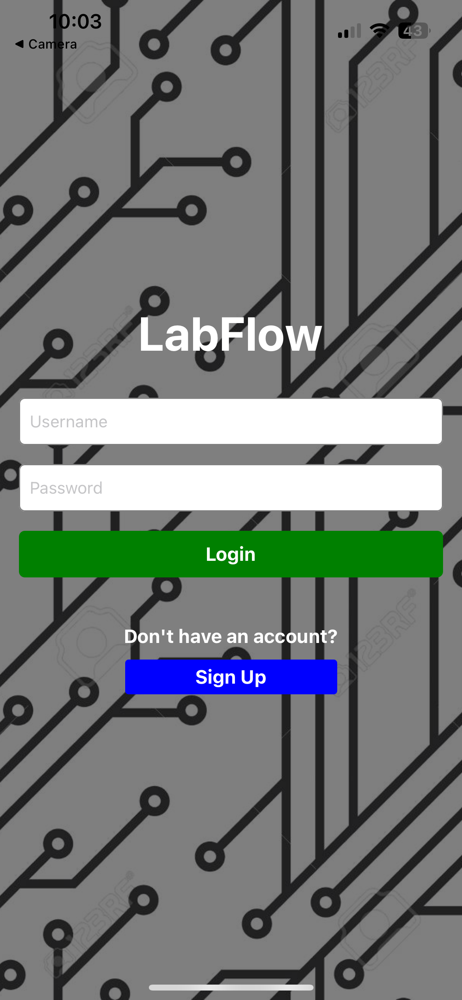
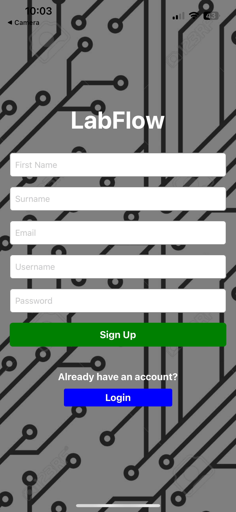
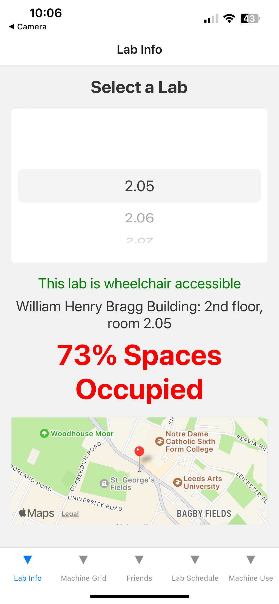
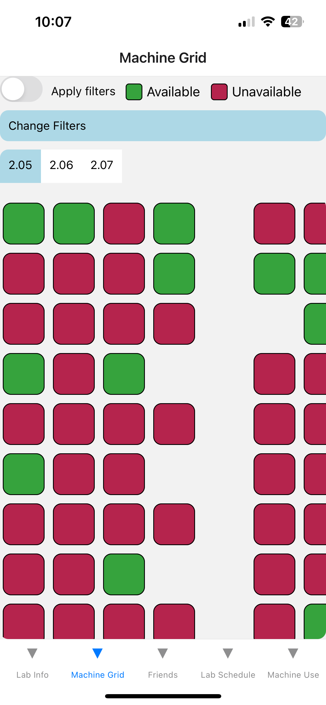
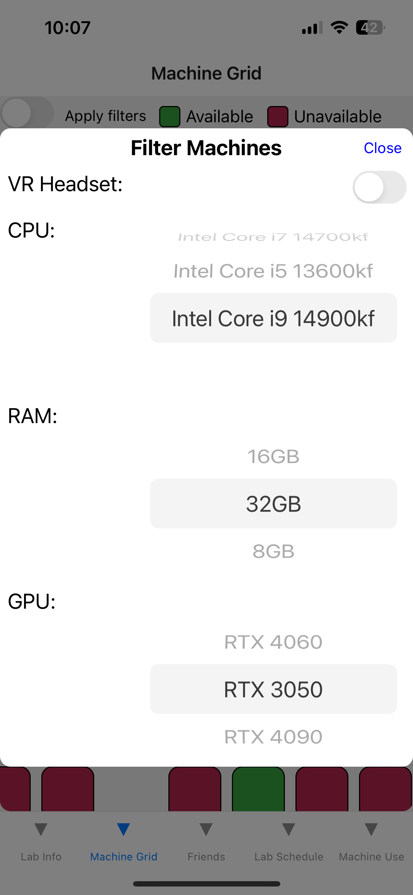
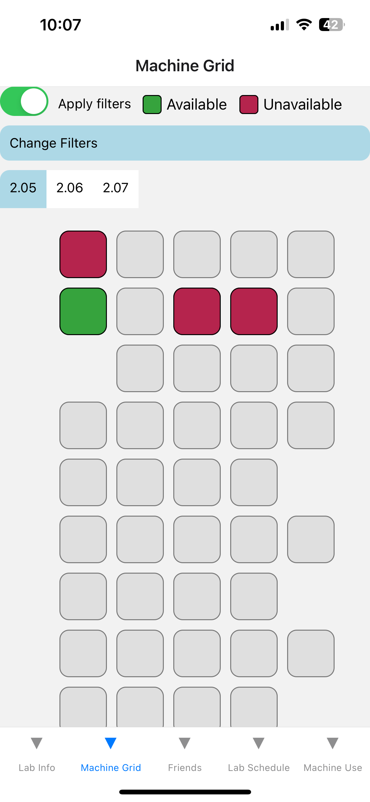
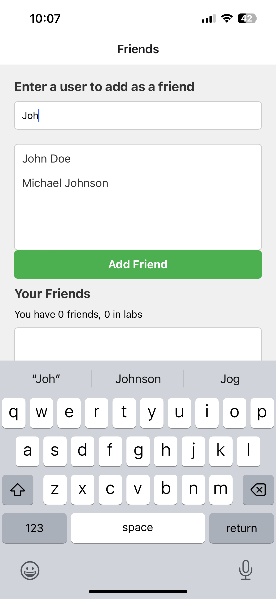
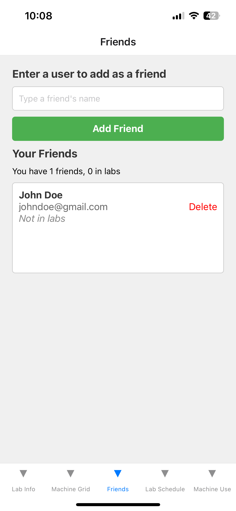
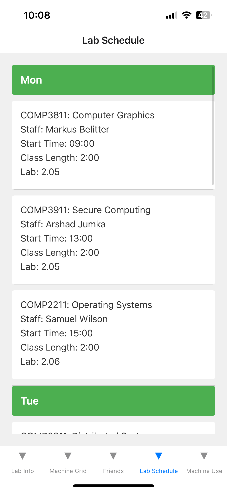
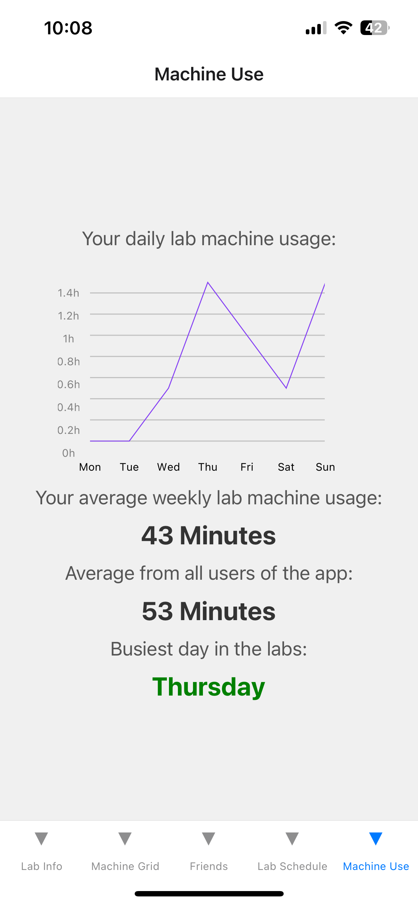

# LabFlow
A visualisation tool for educational facilities to help students better manage their time and gain access to university resources.

## How to run the application
- Download the Expo Go app.
- `cd` into a folder titled LabFlow (ensure the folder contains the file `App.js`) and run the command `npx expo start` in a terminal.
- A QR code will be generated in the terminal. Scan this using the Expo Go app or your phone camera app.
- The app should load and you can create an account to sign up or login if you have a pre-existing account.
- Since this is a demo and still a prototype I have saved the API token as a local environment variable (DO NOT CHANGE THIS OR AUTHENTICATION WILL FAIL).

## How to run unit tests
- `cd` into the folder titled `backend`, this folder should contain a folder titled `tests` which holds all the unit tests for the API endpoints.
- Ensure you have installed the following python libraries onto your system using a package manager of your choice. I will use pip as an example:
    - `pip install requests`
    - `pip install pytest`
    - `pip install datetime`
- Once you have the correct libraries installed. Run the command `pytest`, this will search the `tests` folder for all test files to execute.
- You will have to run this command twice. On first run the tests are likely to fail due to the cold start caused by using serverless functions on a low tier plan.

# Login

# SignUp

# Lab Info Page

# Machine Grid View

# Friends

# Lab Schedule

# Lab Usage

